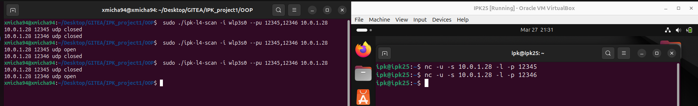
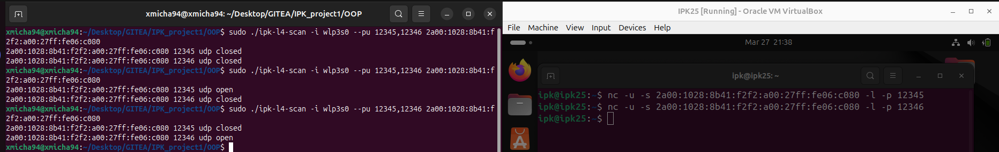
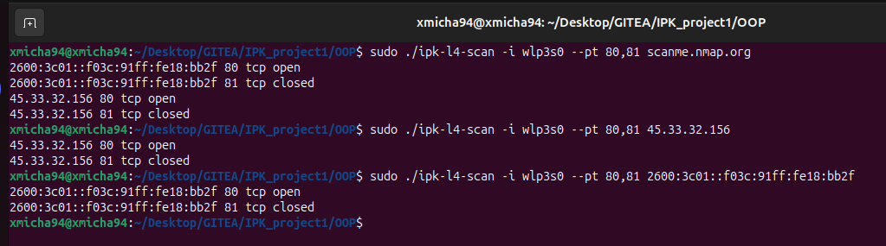
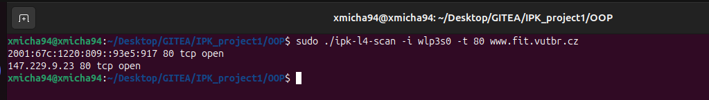

# IPK project 1

## Introduction

This document describes the L4 Scanner project developed for the IPK (Computer Communications) course. The goal is to scan specified TCP and/or UDP ports on a target host and determine their state (open, closed, or filtered). Works for both IPv4 and IPv6.

The project implements:
- TCP SYN scanning (sends raw SYN packets - no full handshake).
- UDP scanning (sends UDP datagrams).

## Usage
First you need to compile:
```
Make
```

Execute format with possible parameters:
```
./ipk-l4-scan [-i interface | --interface interface] [--pu port-ranges | --pt port-ranges | -u port-ranges | -t port-ranges] {-w timeout} [domain-name | ip-address]
```

Example execute:
```
./ipk-l4-scan --interface eth0 -u 53,67 2001:67c:1220:809::93e5:917
./ipk-l4-scan -i eth0 -w 1000 -t 80,443,8080 www.vutbr.cz
```
The complete original specification can be seen [here](https://git.fit.vutbr.cz/NESFIT/IPK-Projects/src/branch/master/Project_1/omega) (while it is available).

## Theoretical Background

### TCP SYN Scan

TCP (Transmission Control Protocol) is a connection-oriented protocol (RFC 793). A SYN scan sends only the initial SYN packet to check if a port is open. It does not do the complete 3-way handshake. If a SYN+ACK arrives, the port is open; if an RST arrives, it’s closed; if no reply arrives after multiple attempts, it’s deemed filtered.

### UDP Scan

UDP (User Datagram Protocol, RFC 768) is connectionless. A typical approach is:

- Send a small UDP packet to the target port.
- If an ICMP Port Unreachable (type 3, code 3) is received, the port is closed.
- If no response is received (no ICMP error), we consider it open.

### IP Header Inclusion

When crafting raw packets (especially TCP SYN), we use IP_HDRINCL to supply our own IP header. This means we must compute checksums (IP + TCP) and set fields like source/dest addresses, ports, sequence numbers, flags, etc.

## Assignment Requirements

According to the IPK instructions:

1. Scan IPv4/IPv6 addresses and specified ports (TCP, UDP, or both).

2. List interfaces if no arguments are given (or if -i/--interface is specified without a value).

3. Use raw sockets for TCP SYN scanning.

4. Mark ports as open, closed, or filtered (for TCP). For UDP, closed if an ICMP unreachable arrives, otherwise open.

5. Output lines of the form:
```
<ip> <port> <tcp|udp> <open|closed|filtered>
```
6. Support timeouts and second attempt for TCP “filtered” detection.

7. Terminate gracefully on Ctrl+C (optional in some specs).

8. Manual or --help output describing usage and arguments.

## Design & Implementation

1. Argument Parser
    - Handles -i/--interface, --pt/--pu, -w (timeout), etc.
    - If no arguments or only -i is given, list interfaces.

2. Scanner
    - TCP: send_syn_packet(), listen_for_response(), attempt #1 → if no response, attempt #2 → if no response, mark filtered.
    - UDP: send small packet → if recvfrom times out, open; if an ICMP error is detected, closed.

3. Output
    - One line per scanned port, e.g. 127.0.0.1 22 tcp open.

## Key Functions

- parse_args()
    - Extracts interface name, port ranges, host, and timeout. If no arguments, calls interface-listing function.

- scan_tcp()
    - Create raw socket: socket(AF_INET, SOCK_RAW, IPPROTO_TCP).
    - Enable IP_HDRINCL.
    - For each port:
        - Craft a TCP header with SYN flag.
        - sendto(...).
        - recvfrom(...) to see if RST or SYN+ACK arrives.
        - If no reply, try again → else mark filtered.

- scan_udp()
    - Create UDP socket.
    - Send a zero-length datagram.
    - Wait for an ICMP type 3 code 3 → closed; else open.

- Checksums
    - We implement IP and TCP checksums if using IP_HDRINCL. This typically involves pseudo-headers for TCP.

## Testing

### UDP Tests



### TCP Tests



## Interface Listing
No arguments → prints all active interfaces, e.g.:
```
lo
eth0
wlan0
```
