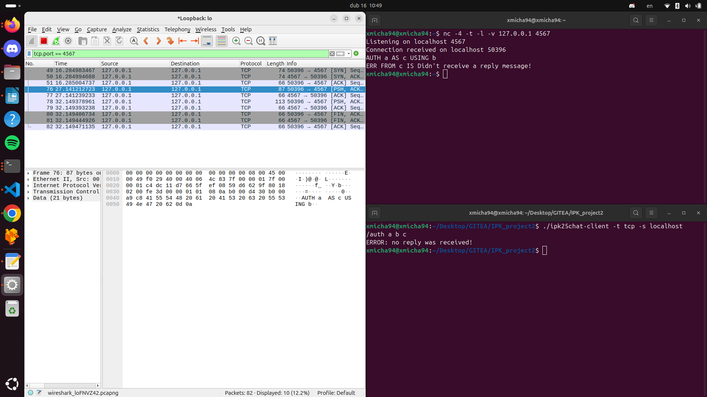
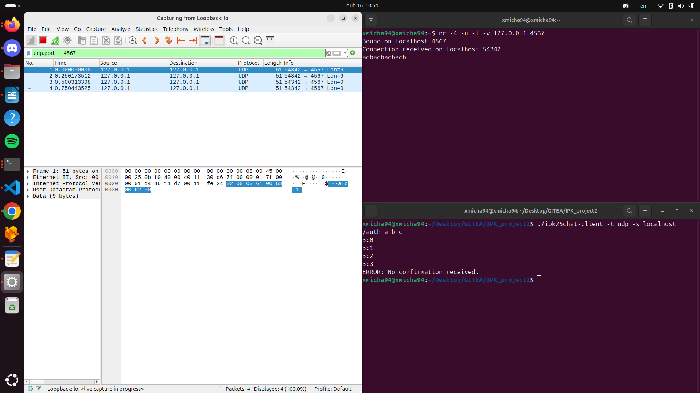
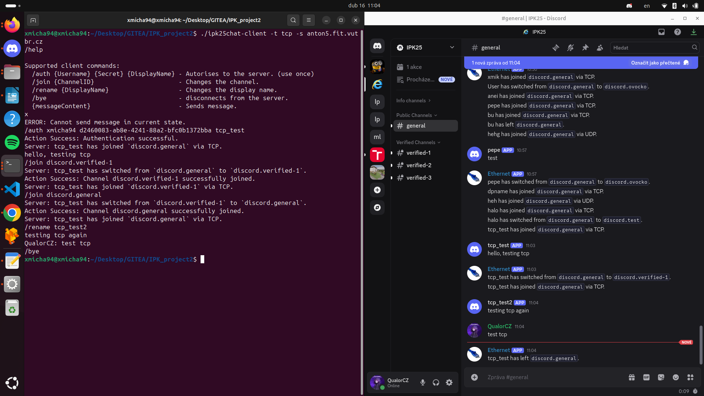
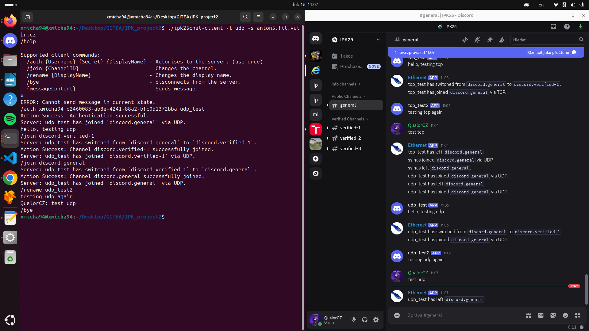

# IPK Project 2 - Client for a Chat Server
## Introduction

This project implements a client for a chat server that uses the IPK25CHAT protocol. The goal of the project is to create a reliable client that allows the user to communicate with the server via text messages, join different channels, and receive responses from the server and react to them appropriately.

The client supports two communication variants – using the TCP and UDP protocols.

### Compilation and Execution

The source codes are located in the main folder together with the Makefile.
To compile and build the project, simply use the command:

```
make
```

Subsequently, a binary file named ipk25chat-client will be created, which can be executed, for example:

```
./ipk25chat-client
```

Without parameters, it only prints the help.

### Parameters

The program supports the following parameters:

```
Usage: ./chatClient -t <protocol> -s <hostname/IP> -p <port> -d <timeout> -r <retransmissions>
       protocol:          udp or tcp. (required)
       hostname:          server hostname or ip. (required)
       port:              server port. (optional)
       timeout:           UDP confirmation timeout in milliseconds. (optional)
       retransmissions:   maximum number of UDP retransmissions. (optional)

Default values for optional arguments:
       port:              4567
       timeout:           250ms
       retransmissions:   3
```


From this, it can be deduced which parameters the user must provide. These are the <b>protocol</b> and server <b>IP/hostname</b>.

Additional optional parameters are <b>server port</b>, <b>confirmation message timeout</b>, and the number of <b>retries</b> to send a message.

If the user does not provide the optional parameters, the default values are used:
port: 4567
timeout: 250ms
retransmissions: 3

### Commands

The client supports several commands that can either be sent to the server or executed locally.

#### Local Commands:

```
/rename {DisplayName}       - Changes the display name locally.
/help                       - Prints out help.
```

With this command, the display name is changed locally and the next message sent to the server will already use the updated name.

#### Server Commands

```
/auth {Username} {Secret} {DisplayName} - Authorizes to the server. (use once)
/join {ChannelID}                       - Changes the channel.
/rename {DisplayName}                   - Changes the display name.
/bye                                    - disconnects from the server.
{messageContent}                        - Sends message.
```

These commands are processed by this client and then sent to the server either via UDP or TCP, depending on which one was chosen when the program was started.

## Theoretical Part

### Overview of Theoretical Foundations

This project works over the transport protocols TCP and UDP, so for understanding this project it is necessary to understand these protocols and how they work.

However, this is not included in this documentation. For self-study, you can use the following links:
TCP: https://datatracker.ietf.org/doc/html/rfc9293
UDP: https://datatracker.ietf.org/doc/html/rfc768

### Summary of Implementation Principles

The entire project is divided into several main parts.
Below is a description of how these parts are interconnected and what their role in the project is.

### Main Program (main.cpp)

This file serves as the entry point of the application. It handles program initialization, command-line argument parsing, setting up signal handlers, and creating an instance of the client (UDPChatClient or TCPChatClient) according to the specified protocol.

#### Functions:

Parsing of arguments (using functions from the utilities module – parseArguments()).

Initialization and configuration (possibly setting global variables for signal handling, such as a socket for TCP).

Creation and execution of an interactive loop in which user commands are processed.

Launching a separate thread for listening to messages from the server (the startListener() method).

#### Utility Functions (utils.h / utils.cpp)

The utilities module contains helper functions that are repeatedly used throughout the project, whether it is parsing inputs, validating text strings, or displaying help.
Key Functions:

<b>parseArguments(int argc, char argv[])</b>
Parses command-line arguments and creates an Options structure with the following fields:
- protocol – the desired protocol (udp or tcp). (Required)
- hostname – the server hostname or IP address. (Required)
- port – the server port (optional, default: 4567).
- timeout – the UDP confirmation timeout in milliseconds (optional, default: 250ms).
- retransmissions – maximum number of UDP retransmissions (optional, default: 3).

<b>split(const std::string &str)</b>
Splits the input string by spaces and returns a vector of tokens.

<b>isValidString(), isPrintableChar(), isValidMessage()</b>
These functions verify that the given strings conform to the rules (e.g., length, allowed characters).

<b>help()</b>
Displays the help for running the program.

<b>commandHelp()</b>
Displays the help for the user during runtime.

### Client Logic – ChatClient and Its Derived Classes

The key part of the project is based on inheritance. The entire chat client is implemented as an abstract class ChatClient, from which concrete classes UDPChatClient and TCPChatClient are derived.

#### ChatClient (Abstract Class)

This class defines the common interfaces and data members used for communication with the server. It includes the connection state (e.g., "start", "auth", "open", "end"), socket management, message ID generation, and virtual methods for sending messages.

The following classes override the virtual methods of the parent class ChatClient so that they suit the communication of the protocol used, and especially the IPK25CHAT protocol.

#### UDPChatClient

This class implements communication using the UDP protocol, which is essential for constructing outgoing and parsing incoming messages. It further implements waiting for a CONFIRM message and the potential resending of a message.

#### TCPChatClient

This class implements communication using the TCP protocol, where messages must adhere to a specified grammar. In other words, it constructs outgoing and parses incoming messages according to this grammar. Additionally, graceful connection termination is implemented here.

### UML Diagrams / Description of Interesting Code Parts

This is a simple diagram describing the classes and inheritance structure within this project. Attributes and methods are omitted for clarity. A detailed description of the classes, including their attributes and methods, can be found in the documentation generated by Doxygen. If you are interested in additional diagrams, you can find them in the doxygen documentation in the docs folder. If docs folder doesn't exists, run:
```
doxygen
```


ChatClient contains virtual methods that both derived classes override and implement according to the protocol used. The mentioned virtual methods are:

<b>~ChatClient()</b> – the destructor, which must be implemented separately in each method since TCP uses connect() and must be terminated properly. Not used for UDP.
<b>connectToServer()</b> – Again, TCP uses connect(). Not used for UDP.

For the following methods, the same reason applies for using virtual methods. The reason is the differences between UDP and TCP regarding message creation, sending, and receiving.
- <b>auth(const std::string &username, const std::string &secret, const std::string &displayName)</b>
- <b>joinChannel(const std::string &channel)</b>
- <b>sendMessage(const std::string &message)</b>
- <b>sendError(const std::string &error)</b>
- <b>bye()</b>
- <b>listen()</b> – loop for receiving messages from the server.
- <b>startListener()</b> – function for creating the listener thread.

## Testing

#### Local

Local testing was performed using the Wireshark program and Netcat. This local testing served to verify the correctness of the build and the messages sent by the client.

#### Reference Server

Furthermore, the provided reference server was used for testing the functionalities of your client.

#### Description of the Test Environment

Testing was carried out on my own computer running Linux.
More precisely, the distribution used was Ubuntu 24.04.1 LTS.
The technical specifications are negligible, excluding any extreme conditions.

#### Wireshark + Netcat

Here, tests were conducted solely to verify whether the correct data is being sent in both of the aforementioned protocols.
The Netcat program was launched on a specific port and address:

```
nc -4 -t -l -v 127.0.0.1 4567      - for TCP listening
nc -4 -u -l -v 127.0.0.1 4567      - for UDP listening
```

When listening and running the program with parameters corresponding to the running instance of Netcat, messages can be sent.

```
./ipk25chat-client -t tcp -s localhost    - TCP variant of the client
./ipk25chat-client -t udp -s localhost    - UDP variant of the client
```

In the terminal where Netcat is running, one can see the messages sent by the client.

For a closer examination, Wireshark can be launched. It must be started with superuser privileges and then the "loopback" interface should be selected, preferably with the following filter:

```
tcp.port == 4567     - for TCP
udp.port == 4567     - for UDP
```

In the TCP variant, when sending /auth,
Note: Netcat only receives and does not send anything. The final implementation waits for a REPLY from the server, which it does not receive, and therefore ERR and BYE messages follow.



In the UDP variant, when sending /auth,
Note: Netcat only receives and does not send anything. The final implementation waits for a CONFIRM from the server, which it does not receive, and thus the AUTH message is re-sent.



This simple test verified whether the messages are properly constructed and sent.

#### Reference Server

Furthermore, individual functionalities specified in the assignment were tested using the reference server.

Testing of TCP variant functionalities:



Testing of UDP variant functionalities:



Some edge cases were verified by tests shared by other students; these tests are not my original work, and therefore they are not listed here.

## Use of AI

Generative AI was used in this project both in the source files and in the documentation. The extent and purpose of its use is explained below.

### Code

In the source files, it was used directly in the commented function headers.
It was further used to broaden the perspective in solving various subproblems, although not for generating the code itself.
Later, it assisted in refactoring the code, so some parts of the code may appear to have been generated by AI, but they were only refactored.

### Documentation

In the documentation, AI was primarily used for stylistic improvements and spelling corrections, i.e., to improve the existing text.
Additionally, the skeleton of this documentation was generated by AI.
Finally, it was also used for translation, as it translates content in context rather than by a conventional translator.

### Conclusion

I hope that this project meets all the requirements specified in the assignment. It implements all functionalities for both protocol variants – TCP and UDP.
It also meets the general requirements for both projects. It is programmed in C++ and utilizes object-oriented programming.
Overall, I consider the project functional and meeting all the assignment points.