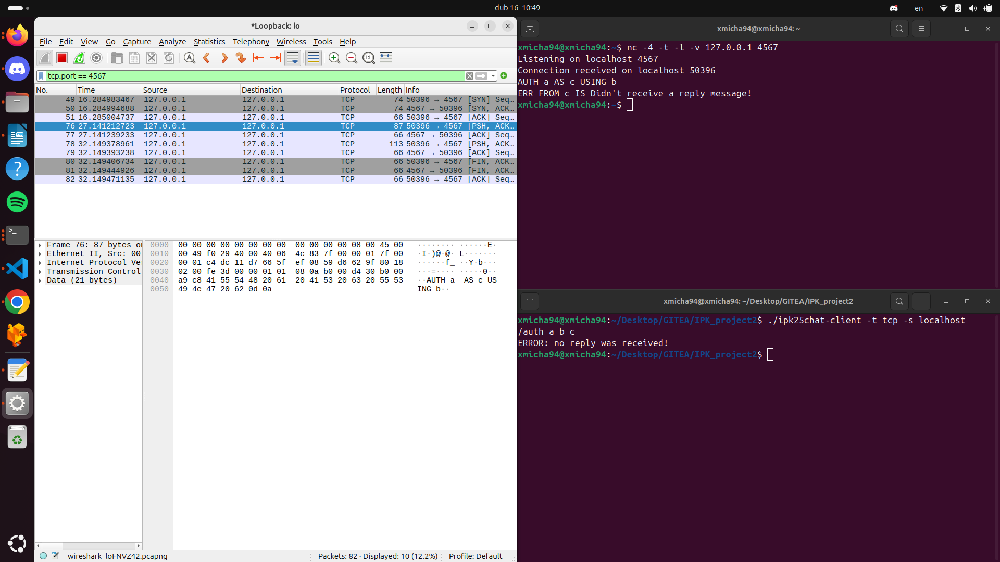

# IPK project 2 - client for a chat server 
## Úvod

Tento projekt implementuje klienta pro chatovací server, který využívá protokol IPK25CHAT. Cílem projektu je vytvořit spolehlivého klienta, který umožňuje uživateli komunikovat se serverem pomocí textových zpráv, připojovat se do různých kanálů a přijímat odpovědi od serveru a adekvátně na ně reagovat. 

Klient podporuje dvě varianty komunikace – pomocí protokolu TCP a UDP.

### Překlad a spuštění
    
Zdrojové kódy jsou v hlavní složce společně se souborem Makefile.
Pro překlad a sestavení projektu tedy stačí použít příkaz:

```
make
```

následně se vyvtoří binární soubor ipk25chat-client, který lze spustit například:

```
./ipk25chat-client
```

Bez parametrů však vypíše pouze nápovědu.

### Parametry

Program poté podporuje tyto parametry:
```
Usage: ./chatClient -t <protocol> -s <hostname/IP> -p <port> -d <timeout> -r <retransmissions>
       protocol:          udp or tcp. (required)
       hostname:          server hostname or ip. (required)
       port:              server port. (optional)
       timeout:           UDP confirmation timeout in milliseconds. (optional)
       retransmissions:   maximum number of UDP retransmissions. (optional)

Default values for optional arguments:
       port:              4567
       timeout:           250ms
       retransmissions:   3
```

Z toho lze vyčíst parametry, které musí uživatel zadat. Těmi jsou <b>volba protokolu</b> a <b>IP adresa/název serveru</b>.

Dále volitelné parametry <b>hostitelského portu</b>, <b>délku času čekání na potvrzovací zprávu</b> a <b>počet dodatečných pokusů pro odeslání zprávy</b>.

Pokud uživatel nezadá volitelné parametry, použijí se výchozí, kterými jsou:
port:4567
timeout: 250ms
retransmisions:3

### Příkazy

Klient podoruje několik příkazů, které lze serveru zaslat nebo lokálně provést nějakou akci.

#### Lokální příkazy:
```
/rename {DisplayName} - changes the display name localy.
```

Při kterém se změní display name lokálně a pošle se v další zprávě serveru již aktualizovaný.

#### Serverové příkazy

```
/auth {Username} {Secret} {DisplayName} - Autorises to the server. (use once)
/join {ChannelID}                       - Changes the channel.
/rename {DisplayName}                   - Changes the display name.
/bye                                    - disconnects from the server.
{messageContent}                        - Sends message.
```

Tyto příkazy jsou zpracováný tímto klientem a následně odeslány serveru a to buď pomocí UDP nebo TCP, podle toho, který byl zvolen při spuštění programu.

## Teoretická část

### Přehled teoretických základů

Tento projekt pracuje nad transportními protokoly TCP a UDP, proto pro pochopení tohoto projektu je potřeba pochopení těchto protokolů a toho, jak fungují.

To však není v této dokumetnaci zahrnuto. K samostudiu lze využít následující odkazy:
TCP: https://datatracker.ietf.org/doc/html/rfc9293
UDP: https://datatracker.ietf.org/doc/html/rfc768

### Shrnutí principů implementace

Celý projekt je rozdělen do několika hlavních částí. 
Níže je popsáno, jak jsou tyto části navzájem propojeny a jaká je jejich role v projektu.

### Hlavní program (main.cpp)

Tento soubor slouží jako vstupní bod aplikace. Zajišťuje inicializaci programu, načítání argumentů příkazové řádky, nastavení signal handlerů a vytvoření instance klienta (UDPChatClient nebo TCPChatClient) podle zadaného protokolu.

#### Funkce:

Parsování argumentů (s využitím funkcí z modulu utilit – parseArguments()).

Inicializace a konfigurace (případně nastavení globálních proměnných pro signal handling, jako je například socket pro TCP).

Vytvoření a spuštění interaktivní smyčky, ve které se zpracovávají uživatelské příkazy.

Spuštění samostatného vlákna pro naslouchání zpráv ze serveru (metoda startListener()).

### Pomocné funkce (utils.h / utils.cpp)

Modul utilit obsahuje pomocné funkce, které se opakovaně používají v celém projektu, ať už jde o parsování vstupů, validaci textových řetězců nebo zobrazení nápovědy.

#### Klíčové funkce:

<b>parseArguments(int argc, char argv[])</b>
Načítá argumenty příkazové řádky a vytváří strukturu Options s následujícími poli:
- protocol – požadovaný protokol (udp nebo tcp). (Povinné)
- hostname – název serveru či IP adresa. (Povinné)
- port – port serveru (volitelný, výchozí: 4567).
- timeout – délka čekání na potvrzení u UDP v milisekundách (volitelný, výchozí: 250ms).
- retry_count – maximální počet retransmisi u UDP (volitelný, výchozí: 3).

<b>split(const std::string &str)</b>
Rozděluje vstupní řetězec podle mezer a vrací vector tokenů.

<b>isValidString(), isPrintableChar(), isValidMessage()</b>
Tyto funkce ověřují, že dané řetězce odpovídají pravidlům (např. délka, povolené znaky).

<b>help()</b>
Vypisuje nápovědu pro exekuci programu.

<b>commandHelp()</b>
Vypisuje nápovědu pro uživatele za běhu.


### Klientská logika – ChatClient a její odvozené třídy

Klíčová část projektu je založena na dědičnosti. Celý chat klient je implementován jako abstraktní třída ChatClient, z níž jsou odvozeny konkrétní třídy UDPChatClient a TCPChatClient.

#### ChatClient (abstraktní třída)

Tato třída definuje společná rozhraní a datové členy používané pro komunikaci se serverem. Zahrnuje stav spojení (např. "start", "auth", "open", "end"), správu socketu, generování identifikátorů zpráv, a virtuální metody pro odesílání zpráv.

Následující třídy přepisují virtuální metody rodičovské třídy ChatClient tak, aby vyhovovali komunikaci dané tímto protokolem a především pak IPK25CHAT protokolu.

#### UDPChatClient

Tato třída implementuje komunikaci pomocí protokolu UDP, které je podstatné pro vytváření odesílaných a rozkládání přijatých zpráv. Nadále implementuje čekaní na CONFIRM zprávy a případné znovuzaslání zprávy.

#### TCPChatClient

Tato třída implementuje komunikaci pomocí protokolu TCP, kde zprávy musí podléhat dané gramatice. Tedy pomocí této gramatiky vytváří odesílané a rozkládá přijaté zprávy. Zde je navíc implementováno gracefull connection termination.

### UML diagramy / popis zajímavých částí kódu
Toto je jednoduchý diagram popisující třídy a dědičnost v rámci tohoto projektu. Atributy a metody lze nejsu uvedeny kvůli přehlednosti. Podrobný popis tříd včetně jejich atributů a metod lze nalézt v dokumentaci vygenerovanou pomocí Doxygen. Pokud vás zajímají další diagramy, naleznete je právě v doxygen dokumentaci ve složce docs. Pokud tato složka neexistuje, pro její vygenerování použijte:
```
doxygen
```


ChatClient obsahuje virtuální metody, které obě dědící třídy ovveride a implementují podle použitého protokolu. Zmíněnými virtuálními metodamy jsou:

- <b>~ChatClient ()</b> - destruktor, který je nutný implementovat v každé metodě zvlášť, jelikož TCP používá connect() a je potřeba ho řádně ukončit. U UDP nevyužito.
- <b>connectToServer ()</b> - Opět TCP využívá connect(). U UDP nevyužito.

U následujících je stejný důvod pro použití virtuálních metod. Tím důvodem je rozdílnost UDP a TCP co se týče tvorbě, odesílání a přijímání zpráv.
- <b>auth (const std::string &username, const std::string secret, const std::string &displayName)</b>
- <b>joinChannel (const std::string &channel)</b>
- <b>sendMessage (const std::string &message)</b>
- <b>sendError (const std::string &error)</b>
- <b>bye ()</b>
- <b>listen ()</b> - smyčka pro přijímaní serverových zpráv.
- <b>startListener ()</b> - funkce pro vytvoření poslouchacího vlákna.

## Testování

#### lokální
Lokální testování probíhalo pomocí programu Wireshark a programu Netcat. Toto lokální testování sloužilo k ověření správnosti sestavení a odesílaní zpráv klientem.

#### referenční server
Dále pro testování byl využit referenční server, který byl přiložen právě pro možnost testování svého klienta.

### Popis testovacího prostředí
Testování bylo vykonáváno na mém vlastním počítači se systémem  Linux.
Přesněji distribucí Ubuntu 24.04.1 LTS.
Technická specifika jsou zanedbatelná, nebereme-li v potaz extrémy.

#### Wireshark + Netcat
Zde bylo testováno pouze, zdali se odesílají správná data a to v obou výše zmíněných protokolech.
Byl spuštěn program Netcat na určitém portu a adrese:
```
nc -4 -t -l -v 127.0.0.1 4567      - poslouchání pro TCP
nc -4 -u -l -v 127.0.0.1 4567      - poslouchání pro UDP
```
Při poslechu a spuštění programu s parametry odpovídajícími běžícímu programu Netcat na něj lze odesílat zprávy.
```
./ipk25chat-client -t tcp -s localhost    - TCP varianta klienta
./ipk25chat-client -t udp -s localhost    - UDP varianta klienta
```

Nyní lze v terminálu, ve kterém běží Netcat vidět zprávy odeslané klientem.

Pro bližší prozkoumání pak lze zapnout wireshark. Ten je potřeba zapnout s právy pro superuživatele a následně zvolit rozhraní "loopback" a nejlépe nastavit filtr na následující:
```
tcp.port == 4567     - pro TCP
udp.port == 4567     - pro UDP
```

TCP varianta při odeslání /auth 
pozn.: Netcat pouze přijímá, nic neodesíla. Hotová implementace čeká REPLY od serveru, kterou neobdrží a tedy následují zprávy ERR a BYE.



UDP varianta při odeslání /auth
pozn.: Netcat pouze přijímá, nic neodesíla. Hotová implementace čeká CONFIRM od serveru, kterou neobdrží a tedy následuje znovuzaslání zprávy AUTH.


Tímto jednoduchým testem bylo ověřeno, zdali se zprávy správně vytváří a odesílají.

#### Referenční server

Nadále byly vyzkoušeny jednotlivé funkcionality dané zadáním pomocí referenčního serveru.

Vyzkoušení funkcionalit TCP varianty:


Vyzkoušení funkcionalit UDP varianty:


Některé edge cases byly ověřeny testy sdílené jinými studenty, tyto testy však nejsou mou autorskou prací, proto je zde neuvádím.

## Využití AI 
Generativní AI byla v tomto projektu použita jak ve zdrojových souborech, tak v dokumentaci.
V jaké míře a za jakým účelem je vysvětleno níže.

### Kód
Ve zdrojových souborech byla využita přímo v kódu na komentované hlavičky funkcí.
Dále byla využita na rozšíření obzorů v rámci řešení různých podproblematik, avšak ne k samotnému generování kódu.
Následně však pomáhala při refaktorování kódu, tedy některé části kódu se můžou zdát vygenerované AI, ale byly pouze refaktorovány.

### Dokumentace
V dokumentaci byla AI použita především na stylistiku a pravopis, tedy předání existujícího textu AI.
Dále kostra této dokumentace byla vygenerována AI. 
Nakonec byla využita pro překlad, jelikož od klasického překladače překládá i v rámci kontextu. 

## Závěr

Tento projekt doufám splňuje všechny požadavky dané zadáním. Implementuje všechny funkcionality pro obě varianty protokolů, tedy jak TCP tak UDP.
Splňuje i obecné zadání pro oba projekty. Je programován v jazyce C++ a je využito objektově orientovaného programování.
Celkově tedy projekt vnímám jako funkční a splňující všechny body zadání. 